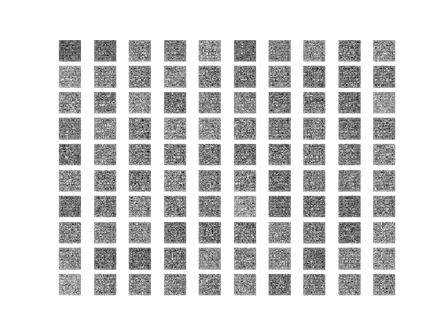
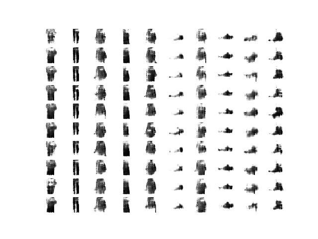
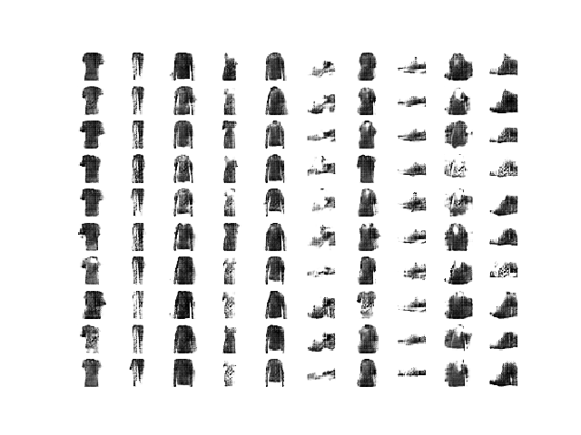
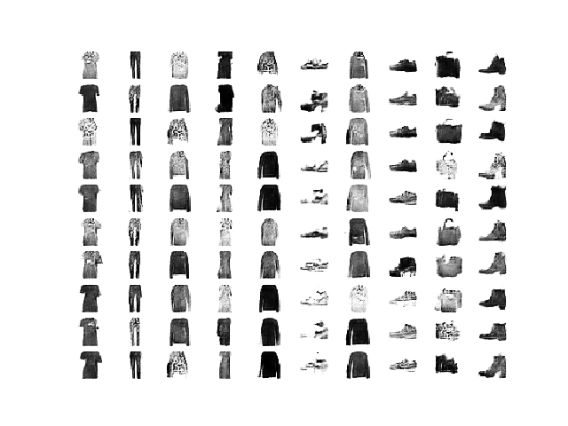
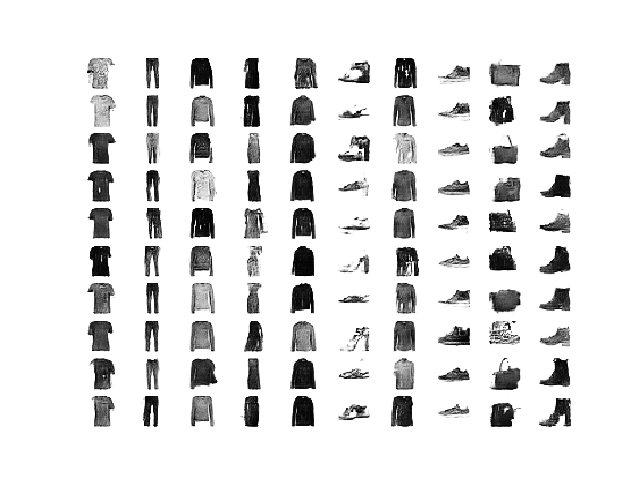
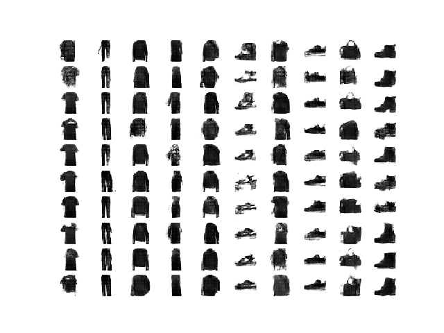
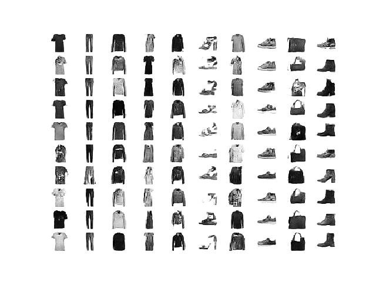

# cGAN

Unconditional GAN and conditional GAN in tf.keras.

# Result

Untrained generator:

Trained after 10 epochs:

Trained after 20 epochs:

Trained after 30 epochs:

Trained after 40 epochs:

Trained after 50 epochs:

Trained after 60 epochs:

+ Reference: [https://machinelearningmastery.com/how-to-develop-a-conditional-generative-adversarial-network-from-scratch/](https://machinelearningmastery.com/how-to-develop-a-conditional-generative-adversarial-network-from-scratch/)
